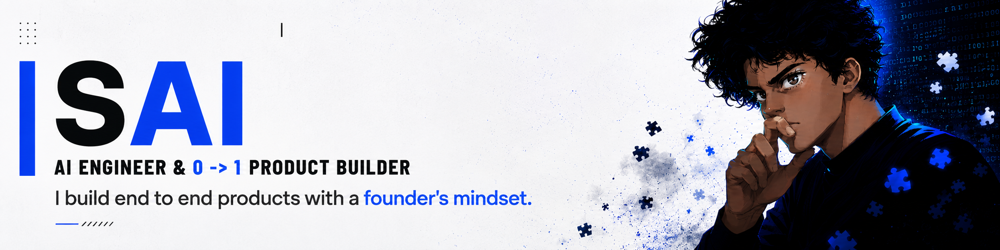

  

  
   
  

<h2 align="center"><strong>FLAGSHIP WORK</strong></h2>

  <strong>SYNC</strong> &nbsp;|&nbsp;
  <a href="https://github.com/Saitarun994/SYNC"><strong>READ MORE →</strong></a> 
  10K+ SIGNUPS · 800 TESTERS &nbsp;|&nbsp; PYTHON · FASTAPI · LANGGRAPH · AWS

---

  <strong>HEIMDALL</strong> &nbsp;|&nbsp;
  <a href="https://github.com/Saitarun994/Heimdall"><strong>READ MORE →</strong></a> 
  PUBLISHED RESEARCH · CAMPUS-SCALE PIPELINE &nbsp;|&nbsp; PYTHON · OPENCV · GAUSSIAN SPLATTING · NERF

---

  <strong>PARKRIGHT</strong> &nbsp;|&nbsp;
  <a href="https://github.com/Saitarun994/Park-Right"><strong>READ MORE →</strong></a> 
  COMPANY PROTOTYPE · REAL-WORLD CV &nbsp;|&nbsp; PYTHON · OPENCV · YOLO · ROBOFLOW

  
<h2 align="center"><strong>SELECTED PROJECTS BY SPECIALIZATION</strong></h2>

<h3 align="center"><strong>GENAI & APPLIED ML PRODUCTS</strong></h3>

<table align="center" width="90%">
<tr>
<td align="center" valign="top" width="33%">
<a href="https://github.com/Saitarun994/tale-forge">
 
<strong>Tale Forge</strong>
</a> 
GENAI · STORY & IMAGE GENERATION
</td>
<td align="center" valign="top" width="33%">
<a href="https://github.com/Saitarun994/Good-Neighbor">
 
<strong>Good Neighbor</strong>
</a> 
GENAI · FULL-STACK COMMUNITY PLATFORM
</td>
<td align="center" valign="top" width="33%">
<a href="https://github.com/Saitarun994/pixigen">
 
<strong>Pixigen</strong>
</a> 
GENAI · FULL-STACK IMAGE APPLICATION
</td>
</tr>
<tr>
<td align="center" valign="top" width="33%">
<a href="https://github.com/Saitarun994/Road-Sense">
 
<strong>Road Sense</strong>
</a> 
COMPUTER VISION · OBJECT & LANE DETECTION
</td>
<td align="center" valign="top" width="33%">
<a href="https://github.com/Saitarun994/Mocap-for-All">
 
<strong>MoCap for All</strong>
</a> 
COMPUTER VISION · REAL-TIME POSE CAPTURE
</td>
<td align="center" valign="top" width="33%">
<a href="https://github.com/Saitarun994/poison_ivy_detection">
 
<strong>Poison Ivy Detection</strong>
</a> 
APPLIED ML · IMAGE CLASSIFICATION
</td>
</tr>
</table>

 

<h3 align="center"><strong>BACKEND, SYSTEMS & PRODUCT ENGINEERING</strong></h3>

<table align="center" width="90%">
<tr>
<td align="center" valign="top" width="33%">
<a href="https://github.com/Saitarun994/Custom-Reliable-UDP-Protocol">
 
<strong>Reliable UDP</strong>
</a> 
NETWORK PROTOCOL ENGINEERING
</td>
<td align="center" valign="top" width="33%">
<a href="https://github.com/Saitarun994/Parallelized-LSH-for-ANN">
 
<strong>Parallelized LSH</strong>
</a> 
HIGH-PERFORMANCE APPROXIMATE SEARCH
</td>
<td align="center" valign="top" width="33%">
<a href="https://github.com/Saitarun994/intrusion_detection_system">
 
<strong>Intrusion Detection</strong>
</a> 
NETWORK ANOMALY DETECTION
</td>
</tr>
<tr>
<td align="center" valign="top" width="33%">
<a href="https://github.com/Saitarun994/Automated_Amzn_Discount_notifier">
 
<strong>Discount Scout</strong>
</a> 
AUTOMATION & NOTIFICATION PIPELINE
</td>
<td align="center" valign="top" width="33%">
<a href="https://github.com/Saitarun994/SolarEnergyViz.tech">
 
<strong>Solar Energy Viz</strong>
</a> 
DATA PROCESSING, FORECASTING & VISUALIZATION
</td>
<td align="center" valign="top" width="33%">
<a href="https://github.com/Saitarun994/TerraVista">
 
<strong>Terra Vista</strong>
</a> 
FULL-STACK LOCAL DISCOVERY PLATFORM
</td>
</tr>
<tr>
<td align="center">&nbsp;</td>
<td align="center" valign="top" width="33%">
<a href="https://github.com/Saitarun994/trivia-odyssey">
 
<strong>Trivia Odyssey</strong>
</a> 
FULL-STACK LOCATION-BASED TRIVIA APP
</td>
<td align="center">&nbsp;</td>
</tr>
</table>

  

---

